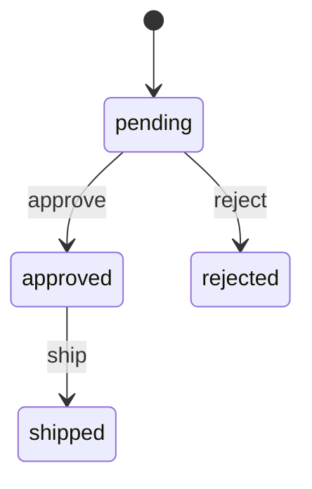

# gofsm-gen

A code generation-based state machine library for Go that provides Rust-level exhaustiveness checking for state transitions.

[](https://github.com/yourusername/gofsm-gen/actions/workflows/ci.yml)
[](https://goreportcard.com/report/github.com/yourusername/gofsm-gen)
[](https://codecov.io/gh/yourusername/gofsm-gen)
[](https://opensource.org/licenses/MIT)

## Overview

gofsm-gen generates type-safe state machine code from YAML or Go DSL definitions, providing compile-time safety through code generation and static analysis using the `exhaustive` tool.

**Key Features:**
- Type-safe state machines with compile-time exhaustiveness checking
- YAML and Go DSL support for FSM definitions
- Guard conditions and transition actions
- Automatic validation and reachability analysis
- State machine visualization (Mermaid/Graphviz)
- Zero-allocation hot path (optional)
- Performance: <50ns per transition

## Quick Start

### Installation

```bash
go install github.com/yourusername/gofsm-gen/cmd/gofsm-gen@latest
```

### Define Your State Machine

Create a YAML file (e.g., `order.yaml`):

```yaml
machine:
  name: OrderStateMachine
  initial: pending

states:
  - name: pending
  - name: approved
  - name: rejected
  - name: shipped

events:
  - approve
  - reject
  - ship

transitions:
  - from: pending
    to: approved
    on: approve
    guard: hasPayment
    action: chargeCard
  - from: pending
    to: rejected
    on: reject
  - from: approved
    to: shipped
    on: ship
    action: notifyShipping
```

### Generate Code

```bash
gofsm-gen -spec=order.yaml -out=order_fsm.gen.go
```

### Use the Generated State Machine

```go
package main

import (
    "context"
    "log"
)

func main() {
    // Define guards
    guards := OrderGuards{
        HasPayment: func(ctx context.Context, c *OrderContext) bool {
            return c.PaymentMethod != ""
        },
    }

    // Define actions
    actions := OrderActions{
        ChargeCard: func(ctx context.Context, from, to OrderState, c *OrderContext) error {
            log.Printf("Charging card for order %s", c.OrderID)
            return nil
        },
        NotifyShipping: func(ctx context.Context, from, to OrderState, c *OrderContext) error {
            log.Printf("Notifying shipping for order %s", c.OrderID)
            return nil
        },
    }

    // Create state machine
    sm := NewOrderStateMachine(guards, actions)

    // Trigger transitions
    ctx := context.Background()
    if err := sm.Transition(ctx, OrderEventApprove); err != nil {
        log.Fatal(err)
    }

    // Check current state
    log.Printf("Current state: %s", sm.State())
}
```

## Why gofsm-gen?

### Problem: Runtime State Machine Errors

Traditional state machine libraries in Go check validity at runtime:

```go
// Runtime error - only discovered when this code path executes
sm.Transition("invalid-event") // Error: invalid transition
```

### Solution: Compile-Time Safety

gofsm-gen generates code with exhaustive switch statements:

```go
// Compiler error if any case is missing
switch event {
case OrderEventApprove:
    // Handle approve
case OrderEventReject:
    // Handle reject
case OrderEventShip:
    // Handle ship
// Compiler enforces all cases are handled
}
```

The generated code includes `//exhaustive:enforce` annotations that the static analyzer validates, ensuring all states and events are properly handled.

## Features in Detail

### Guards and Actions

- **Guards**: Conditional predicates that control whether a transition can occur
- **Actions**: Code executed during a transition
- **Entry/Exit Hooks**: Code executed when entering or leaving a state

### Static Analysis

The generator performs comprehensive validation:

- **Reachability Analysis**: Ensures all states are reachable from the initial state
- **Determinism Checking**: Detects conflicting unguarded transitions
- **Completeness Validation**: Verifies all referenced states and events are defined
- **Guard Conflict Detection**: Warns if multiple guards could be true simultaneously

### Visualization

Generate state machine diagrams:

```bash
gofsm-gen -spec=fsm.yaml -visualize=mermaid
```

Output:


## Documentation

- [Setup Guide](SETUP.md) - Development environment setup
- [CLAUDE.md](CLAUDE.md) - Project guidelines and architecture
- [Examples](examples/) - Example state machine definitions
- [API Documentation](https://pkg.go.dev/github.com/yourusername/gofsm-gen)

## Development

### Prerequisites

- Go 1.23 or later
- golangci-lint (for linting)
- make (optional)

### Building

```bash
# Clone the repository
git clone https://github.com/yourusername/gofsm-gen.git
cd gofsm-gen

# Install dependencies
go mod download

# Build
make build

# Run tests
make test

# Run all checks
make all
```

See [SETUP.md](SETUP.md) for detailed development environment setup.

## Contributing

We welcome contributions! This project follows Test-Driven Development (TDD):

1. Write tests first
2. Implement minimum code to pass
3. Refactor while keeping tests green

Please ensure:
- All tests pass (`make test`)
- Code is formatted (`make fmt`)
- Linting passes (`make lint`)
- Coverage remains >90%

## Roadmap

- **Phase 1**: YAML definitions + basic code generation + exhaustive integration
- **Phase 2**: Guards/actions + Go DSL support
- **Phase 3**: VSCode extension + enhanced tooling
- **Phase 4**: Hierarchical state machines + history states

See [TODO.md](docs/TODO.md) for detailed task tracking.

## License

MIT License - see [LICENSE](LICENSE) for details.

## Acknowledgments

Inspired by Rust's exhaustiveness checking for enums and pattern matching.
