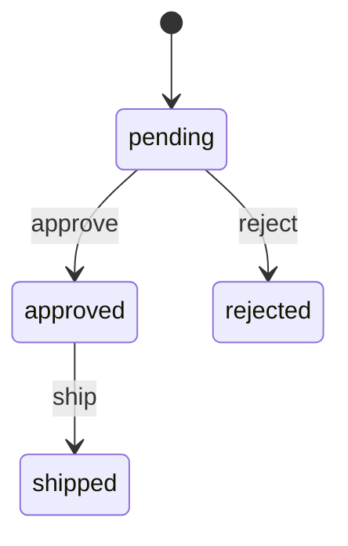

# gofsm-gen

A code generation-based state machine library for Go that provides **Rust-level exhaustiveness checking** for state transitions.

[](https://github.com/yourusername/gofsm-gen/actions/workflows/ci.yml)
[](https://goreportcard.com/report/github.com/yourusername/gofsm-gen)
[](https://codecov.io/gh/yourusername/gofsm-gen)
[](https://pkg.go.dev/github.com/yourusername/gofsm-gen)
[](https://opensource.org/licenses/MIT)

## Overview

gofsm-gen generates type-safe state machine code from YAML or Go DSL definitions, providing compile-time safety through code generation and static analysis using the `exhaustive` tool.

**Key Features:**
- **Compile-time Safety**: Exhaustiveness checking ensures all state transitions are handled
- **Type-safe**: Generated code uses strongly-typed enums for states and events
- **Zero Runtime Overhead**: Minimal performance impact with <50ns per transition
- **Flexible Definitions**: Support for YAML, HCL, and Go DSL
- **Guards & Actions**: Conditional transitions with side effects
- **Visualization**: Generate Mermaid and Graphviz diagrams
- **Testing Support**: Generate unit tests and mocks automatically
- **Static Analysis**: Validates reachability, determinism, and completeness

## Quick Start

### Installation

```bash
go install github.com/yourusername/gofsm-gen/cmd/gofsm-gen@latest
```

### Define Your State Machine

Create a YAML file (e.g., `order.yaml`):

```yaml
machine:
  name: OrderStateMachine
  initial: pending

states:
  - name: pending
  - name: approved
  - name: rejected
  - name: shipped

events:
  - approve
  - reject
  - ship

transitions:
  - from: pending
    to: approved
    on: approve
    guard: hasPayment
    action: chargeCard
  - from: pending
    to: rejected
    on: reject
  - from: approved
    to: shipped
    on: ship
    action: notifyShipping
```

### Generate Code

```bash
gofsm-gen -spec=order.yaml -out=order_fsm.gen.go
```

### Use the Generated State Machine

```go
package main

import (
    "context"
    "log"
)

func main() {
    // Define guards
    guards := OrderGuards{
        HasPayment: func(ctx context.Context, c *OrderContext) bool {
            return c.PaymentMethod != ""
        },
    }

    // Define actions
    actions := OrderActions{
        ChargeCard: func(ctx context.Context, from, to OrderState, c *OrderContext) error {
            log.Printf("Charging card for order %s", c.OrderID)
            return nil
        },
        NotifyShipping: func(ctx context.Context, from, to OrderState, c *OrderContext) error {
            log.Printf("Notifying shipping for order %s", c.OrderID)
            return nil
        },
    }

    // Create state machine
    sm := NewOrderStateMachine(guards, actions)

    // Trigger transitions
    ctx := context.Background()
    if err := sm.Transition(ctx, OrderEventApprove); err != nil {
        log.Fatal(err)
    }

    // Check current state
    log.Printf("Current state: %s", sm.State())

    // Get permitted events
    events := sm.PermittedEvents()
    log.Printf("Permitted events: %v", events)
}
```

## Why gofsm-gen?

### Problem: Runtime State Machine Errors

Traditional state machine libraries in Go check validity at runtime:

```go
// Runtime error - only discovered when this code path executes
sm.Transition("invalid-event") // Error: invalid transition
```

Issues with runtime validation:
- Runtime panics from invalid transitions
- Incomplete event handling going unnoticed
- Difficulty maintaining large state machines
- No compile-time guarantees

### Solution: Compile-Time Safety

gofsm-gen generates code with exhaustive switch statements:

```go
// Compiler error if any case is missing
switch event {
case OrderEventApprove:
    // Handle approve
case OrderEventReject:
    // Handle reject
case OrderEventShip:
    // Handle ship
// Compiler enforces all cases are handled
}
```

The generated code includes `//exhaustive:enforce` annotations that the static analyzer validates, ensuring all states and events are properly handled at compile time.

## Core Concepts

### States & Events

States represent the possible conditions of your system, while events trigger transitions between states:

```go
const (
    OrderStatePending OrderState = iota
    OrderStateApproved
    OrderStateRejected
    OrderStateShipped
)

const (
    OrderEventApprove OrderEvent = iota
    OrderEventReject
    OrderEventShip
)
```

### Transitions

Transitions define how the system moves from one state to another:

```yaml
transitions:
  - from: pending
    to: approved
    on: approve
    guard: hasPayment      # Optional: condition for transition
    action: chargeCard     # Optional: side effect to execute
```

### Guards

Guards are predicates that control whether a transition can occur:

```go
guards := OrderGuards{
    HasPayment: func(ctx context.Context, c *OrderContext) bool {
        return c.PaymentMethod != ""
    },
}
```

### Actions

Actions are functions executed during transitions:

```go
actions := OrderActions{
    ChargeCard: func(ctx context.Context, from, to OrderState, c *OrderContext) error {
        return processPayment(c)
    },
}
```

## Features in Detail

### Entry and Exit Actions

Execute code when entering or leaving states:

```yaml
states:
  - name: approved
    entry: sendConfirmationEmail
    exit: cleanupTemporaryData
```

### Static Analysis

The generator performs comprehensive validation:

- **Reachability Analysis**: Ensures all states are reachable from the initial state
- **Determinism Checking**: Detects conflicting unguarded transitions
- **Completeness Validation**: Verifies all referenced states and events are defined
- **Guard Conflict Detection**: Warns if multiple guards could be true simultaneously

### Visualization

Generate state machine diagrams:

```bash
gofsm-gen -spec=fsm.yaml -visualize=mermaid
```

Output:


### Test Generation

Automatically generate unit tests for your state machine:

```bash
gofsm-gen -spec=order.yaml -generate-tests -out=order_fsm.gen.go
```

## Performance

gofsm-gen is designed for high-performance applications:

- **<50ns per transition**: Minimal overhead for state changes
- **<1KB per instance**: Low memory footprint
- **Zero allocations**: Optional zero-allocation mode for hot paths
- **Fast code generation**: <1 second for 1000 states

See [benchmarks/](benchmarks/) for detailed performance metrics.

## Documentation

- [Installation Guide](docs/installation.md) - Detailed installation instructions
- [Basic Usage Guide](docs/usage.md) - Getting started with gofsm-gen
- [YAML Definition Reference](docs/yaml-reference.md) - Complete YAML syntax reference
- [API Documentation](docs/api.md) - Generated code API reference
- [Setup Guide](SETUP.md) - Development environment setup
- [CLAUDE.md](CLAUDE.md) - Project guidelines and architecture

## Examples

Explore complete examples in the [examples/](examples/) directory:

- **Order Processing**: E-commerce order workflow
- **Door Lock**: Physical access control
- **Traffic Light**: Simple cyclic state machine
- **Game Character**: RPG character state management

## Development

### Prerequisites

- Go 1.23 or later
- **golangci-lint v2.x** (for linting - **REQUIRED**, do NOT use v1.x)
- make (optional)

> **⚠️ Important**: This project requires golangci-lint v2.x. Version 1.x is NOT supported. See [SETUP.md](SETUP.md) for installation instructions.

### Building

```bash
# Clone the repository
git clone https://github.com/yourusername/gofsm-gen.git
cd gofsm-gen

# Install dependencies
go mod download

# Build
make build

# Run tests
make test

# Run all checks
make all
```

See [SETUP.md](SETUP.md) for detailed development environment setup.

## Contributing

We welcome contributions! This project follows Test-Driven Development (TDD):

1. Write tests first
2. Implement minimum code to pass
3. Refactor while keeping tests green

Please read our [Contributing Guide](CONTRIBUTING.md) for details on:
- Setting up the development environment
- Running tests (we use TDD!)
- Code style guidelines
- Submitting pull requests

Please ensure:
- All tests pass (`make test`)
- Code is formatted (`make fmt`)
- Linting passes (`make lint`)
- Coverage remains >90%

## Roadmap

- **Phase 1**: YAML definitions + basic code generation + exhaustive integration
- **Phase 2**: Guards/actions + Go DSL support
- **Phase 3**: VSCode extension + enhanced tooling
- **Phase 4**: Hierarchical state machines + history states

See [TODO.md](docs/TODO.md) for detailed task tracking.

## License

MIT License - see [LICENSE](LICENSE) for details.

## Acknowledgments

Inspired by:
- Rust's exhaustive pattern matching and enum handling
- [Stateless](https://github.com/dotnet-state-machine/stateless) for .NET
- [XState](https://github.com/statelyai/xstate) for JavaScript

## Support

- Report issues: [GitHub Issues](https://github.com/yourusername/gofsm-gen/issues)
- Discussions: [GitHub Discussions](https://github.com/yourusername/gofsm-gen/discussions)
- API Documentation: [pkg.go.dev](https://pkg.go.dev/github.com/yourusername/gofsm-gen)
