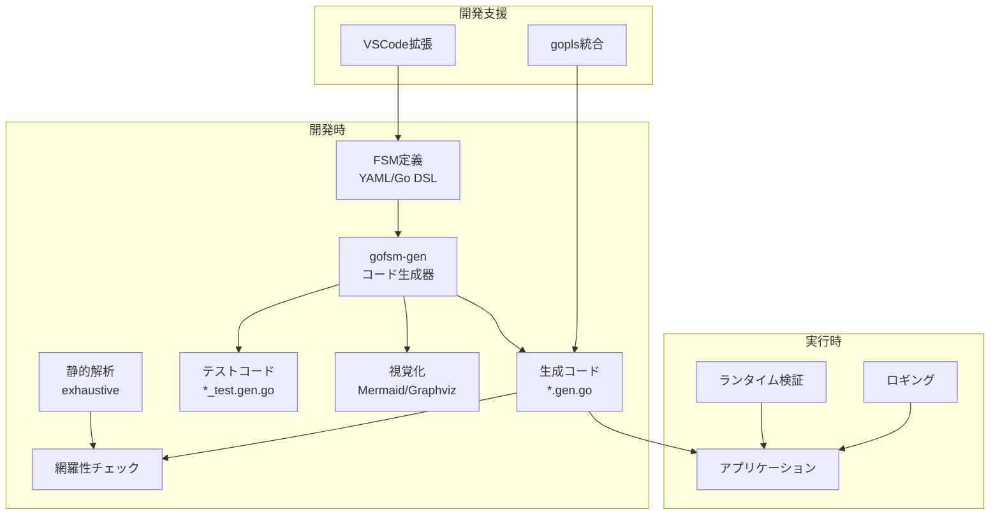
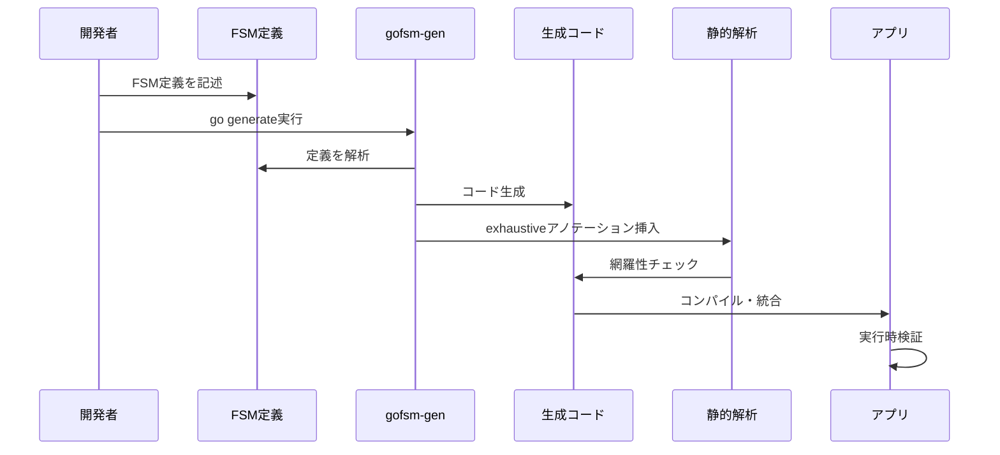

# gofsm-gen 概要設計書

## 1. システム概要

### 1.1 目的

Goの言語制約の中で、Rustのenumベースステートマシンの網羅性チェックに近い開発体験を提供する、コード生成ベースのステートマシンライブラリを開発する。

### 1.2 主要コンセプト

- **コンパイル時相当の安全性**: コード生成 + 静的解析で実現
- **優れた開発体験**: IDE統合、視覚化、明確なエラーメッセージ
- **ゼロコスト抽象化**: 生成コードは手書きと同等のパフォーマンス
- **段階的導入**: 既存プロジェクトへの非侵襲的統合

### 1.3 システム構成図



## 2. アーキテクチャ設計

### 2.1 レイヤー構造

```
┌─────────────────────────────────────┐
│         Application Layer            │ <- ユーザーアプリケーション
├─────────────────────────────────────┤
│         Generated Code Layer         │ <- 生成された型安全なコード
├─────────────────────────────────────┤
│         Code Generation Layer        │ <- gofsm-genツール
├─────────────────────────────────────┤
│         Definition Layer             │ <- FSM定義（YAML/DSL）
└─────────────────────────────────────┘
```

### 2.2 コンポーネント構成

| コンポーネント | 責務 | 技術選定 |
|------------|------|---------|
| Definition Parser | FSM定義の解析 | YAML/HCL/Go AST |
| Model Builder | 内部モデル構築 | Go構造体 |
| Code Generator | Goコード生成 | text/template |
| Static Analyzer | 網羅性チェック | exhaustive |
| Test Generator | テストコード生成 | text/template |
| Visualizer | 状態遷移図生成 | Mermaid/Graphviz |
| Runtime Validator | 実行時検証 | Goランタイム |

### 2.3 データフロー



## 3. 機能要件

### 3.1 コア機能

#### F1: FSM定義

- YAML/HCL/Go DSLによる宣言的定義
- 状態、イベント、遷移の定義
- ガード条件、アクションの定義
- 階層的ステート（Phase 4）

#### F2: コード生成

- 型安全な状態・イベント列挙型生成
- 網羅的なswitch文による遷移ロジック生成
- exhaustiveアノテーション自動挿入
- テストコード自動生成

#### F3: 安全性保証

- コンパイル時の型チェック
- 静的解析による網羅性チェック
- ランタイム検証モード
- ガード条件の相互排他性検証

#### F4: 開発体験

- IDE自動補完サポート
- 状態遷移図の自動生成
- 明確なエラーメッセージ
- ホットリロード対応

### 3.2 機能マトリクス

| 機能 | Phase 1 | Phase 2 | Phase 3 | Phase 4 |
|-----|---------|---------|---------|---------|
| YAML定義 | ✓ | ✓ | ✓ | ✓ |
| 基本コード生成 | ✓ | ✓ | ✓ | ✓ |
| exhaustive統合 | ✓ | ✓ | ✓ | ✓ |
| ガード/アクション | - | ✓ | ✓ | ✓ |
| Go DSL | - | ✓ | ✓ | ✓ |
| VSCode拡張 | - | - | ✓ | ✓ |
| 階層的ステート | - | - | - | ✓ |

## 4. 非機能要件

### 4.1 パフォーマンス要件

- 状態遷移: < 50ns/transition
- メモリ使用量: < 1KB/instance
- コード生成時間: < 1秒（1000状態まで）

### 4.2 品質要件

- テストカバレッジ: > 90%
- 静的解析エラー: 0
- ドキュメント化率: 100%（公開API）

### 4.3 運用要件

- Go 1.18+ サポート
- CI/CD統合可能
- バージョン管理対応

## 5. インターフェース設計

### 5.1 CLI インターフェース

```bash
# 基本的なコード生成
gofsm-gen -spec=statemachine.yaml -out=fsm.gen.go

# Go DSLからの生成
gofsm-gen -type=OrderStateMachine

# 型推論モード
gofsm-gen -infer -type=DoorLock

# オプション
gofsm-gen \
  -spec=fsm.yaml \
  -out=fsm.gen.go \
  -package=myfsm \
  -generate-tests \
  -generate-mocks \
  -visualize=mermaid
```

### 5.2 定義インターフェース（YAML）

```yaml
machine:
  name: OrderStateMachine
  initial: pending
  
states:
  - name: pending
    entry: logEntry
    exit: logExit
  - name: approved
  - name: rejected
  - name: shipped
  
events:
  - approve
  - reject
  - ship
  
transitions:
  - from: pending
    to: approved
    on: approve
    guard: hasPayment
    action: chargeCard
```

### 5.3 生成コードインターフェース

```go
// 基本的な使用方法
guards := OrderGuards{
    HasPayment: func(ctx context.Context, c *OrderContext) bool {
        return c.PaymentMethod != ""
    },
}

actions := OrderActions{
    ChargeCard: func(ctx context.Context, from, to OrderState, c *OrderContext) error {
        return processPayment(c)
    },
}

sm := NewOrderStateMachine(guards, actions,
    WithLogger(logger),
    WithValidationMode(true),
)

// 状態遷移
err := sm.Transition(ctx, OrderEventApprove)

// 状態確認
state := sm.State()

// 許可されたイベント取得
events := sm.PermittedEvents()
```

## 6. セキュリティ設計

### 6.1 コード生成時のセキュリティ

- インジェクション攻撃防止（定義ファイルのサニタイズ）
- 生成コードの検証
- 依存関係の最小化

### 6.2 実行時のセキュリティ

- パニック防止設計
- リソースリーク防止
- 並行実行時の安全性（mutex/atomic）

## 7. 拡張性設計

### 7.1 プラグインアーキテクチャ

```go
type Generator interface {
    Name() string
    Generate(model *FSMModel) ([]byte, error)
}

type Validator interface {
    Validate(model *FSMModel) []ValidationError
}
```

### 7.2 カスタムテンプレート

- ユーザー定義テンプレートのサポート
- テンプレート変数の公開API

## 8. 移行戦略

### 8.1 既存ライブラリからの移行

- looplab/fsm → gofsm-gen 移行ツール
- qmuntal/stateless → gofsm-gen 移行ツール
- 段階的移行のサポート

### 8.2 導入ステップ

1. 小規模なステートマシンで試験導入
2. CI/CDへの統合
3. 既存コードの段階的置き換え
4. 完全移行

## 9. リスク分析

### 9.1 技術的リスク

| リスク | 影響度 | 発生確率 | 対策 |
|-------|-------|---------|-----|
| Go言語の制約による機能制限 | 高 | 中 | 代替アプローチの準備 |
| パフォーマンス目標未達成 | 中 | 低 | 早期ベンチマーク実施 |
| 既存ツールとの競合 | 低 | 中 | 明確な差別化 |

### 9.2 運用リスク

- 学習曲線: ドキュメント・サンプル充実
- バージョン互換性: セマンティックバージョニング徹底
- コミュニティ採用: オープンソース化・積極的PR

## 10. 成功指標

### 10.1 定量的指標

- GitHub Stars: 1年で1000+
- 採用プロジェクト数: 100+
- パフォーマンス: 既存ライブラリと同等以上
- バグ報告数: < 月10件

### 10.2 定性的指標

- 開発者満足度: 高評価レビュー
- コミュニティの活発さ: PR・Issue数
- エコシステム統合: 主要フレームワークでの採用
